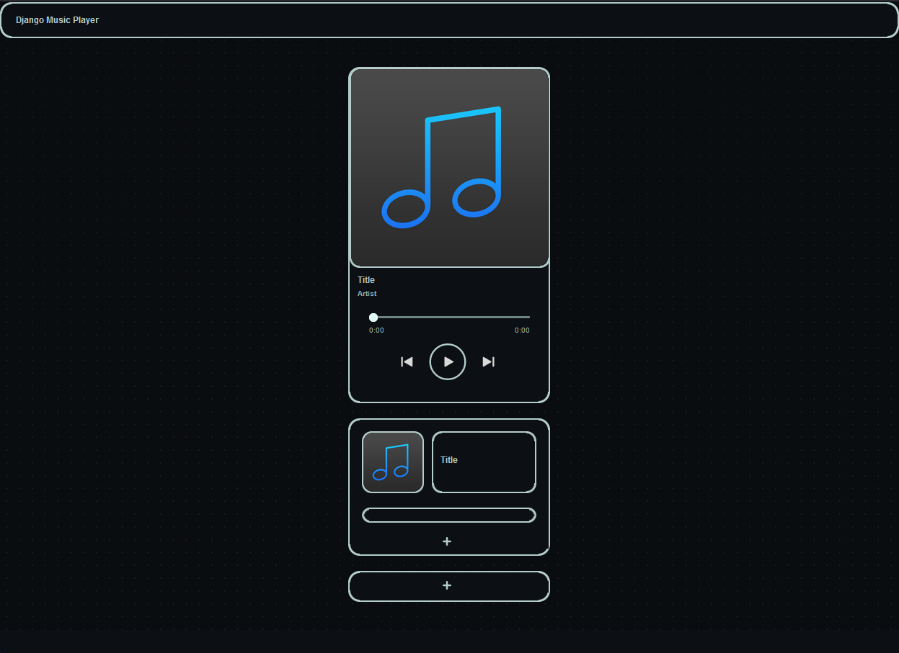

## Установка зависимостей
Находясь в папке проекта, выполните команду:

`pip install -r requirements.txt`

## Запуск сервера
Перейдите в директорию проекта и выполните команду:

`python manage.py runserver`

Адрес сервера: `http://127.0.0.1:8000/`

## Вид плеера

